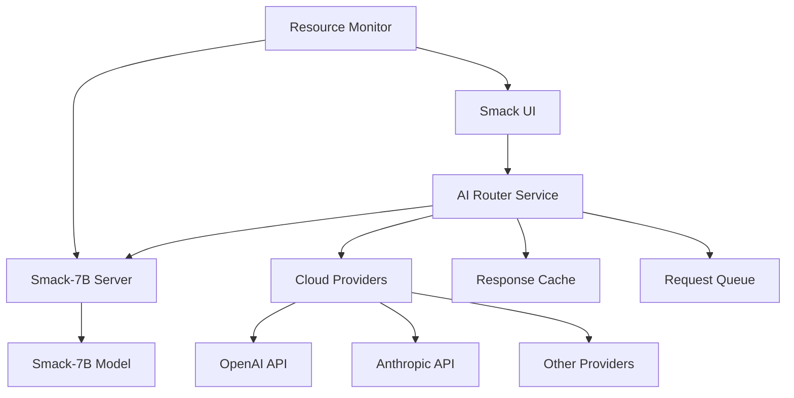

# Design Document

## Overview

The Smack-7B integration adds a locally-hosted AI model to the existing Smack AI platform. The design leverages a microservice architecture with a dedicated model server, smart request routing, and seamless integration with the existing AI provider system. The solution prioritizes performance, reliability, and user experience while maintaining the flexibility to scale or modify the model setup.

## Architecture

### High-Level Architecture



### Component Architecture

1. **Model Server**: FastAPI-based server hosting Smack-7B using transformers/vLLM
2. **AI Router**: Enhanced routing logic to intelligently select providers
3. **Resource Monitor**: System resource tracking and optimization
4. **Provider Integration**: Seamless integration with existing AI SDK architecture

## Components and Interfaces

### Smack-7B Model Server

**Technology Stack:**
- **FastAPI** for HTTP API server
- **transformers** or **vLLM** for model inference
- **asyncio** for concurrent request handling
- **pydantic** for request/response validation

**API Interface:**
```typescript
interface SmackModelRequest {
  messages: ChatMessage[];
  temperature?: number;
  max_tokens?: number;
  stream?: boolean;
}

interface SmackModelResponse {
  choices: {
    message: {
      role: string;
      content: string;
    };
    finish_reason: string;
  }[];
  usage: {
    prompt_tokens: number;
    completion_tokens: number;
    total_tokens: number;
  };
}
```

**Key Features:**
- OpenAI-compatible API format for seamless integration
- Streaming response support for real-time feedback
- Request queuing and batching for efficiency
- Health check endpoints for monitoring

### AI Router Service

**Enhanced Provider Selection Logic:**
```typescript
interface ProviderRouter {
  selectProvider(request: AIRequest): Promise<AIProvider>;
  routeRequest(request: AIRequest): Promise<AIResponse>;
  handleFallback(error: Error, request: AIRequest): Promise<AIResponse>;
}
```

**Routing Rules:**
1. **Code-related tasks** → Smack-7B (if available)
2. **General conversation** → User's preferred cloud provider
3. **Fallback scenarios** → Next best available provider
4. **Load balancing** → Distribute based on current load

### Resource Monitor

**Monitoring Interface:**
```typescript
interface ResourceMetrics {
  memory: {
    used: number;
    total: number;
    percentage: number;
  };
  cpu: {
    usage: number;
    cores: number;
  };
  model: {
    status: 'loading' | 'ready' | 'error' | 'stopped';
    queueLength: number;
    averageResponseTime: number;
  };
}
```

### Provider Integration

**Extended AI Provider Interface:**
```typescript
interface SmackAIProvider extends AIProvider {
  type: 'local' | 'cloud';
  healthCheck(): Promise<boolean>;
  getMetrics(): Promise<ResourceMetrics>;
  configure(settings: ModelSettings): Promise<void>;
}
```

## Data Models

### Model Configuration
```typescript
interface SmackModelConfig {
  modelPath: string;
  serverPort: number;
  maxConcurrentRequests: number;
  defaultSettings: {
    temperature: number;
    maxTokens: number;
    topP: number;
  };
  resourceLimits: {
    maxMemoryGB: number;
    maxCpuPercent: number;
  };
}
```

### Request Context
```typescript
interface RequestContext {
  taskType: 'code_generation' | 'code_review' | 'debugging' | 'general';
  language?: string;
  complexity: 'simple' | 'medium' | 'complex';
  userPreferences: {
    preferredProvider?: string;
    allowFallback: boolean;
  };
}
```

## Error Handling

### Model Server Errors
1. **Startup Failures**: Graceful degradation to cloud providers
2. **Memory Issues**: Automatic request throttling and user warnings
3. **Model Loading Errors**: Clear error messages with troubleshooting steps
4. **Network Issues**: Retry logic with exponential backoff

### Fallback Strategy
```typescript
const fallbackChain = [
  'smack-7b',
  'user-preferred-cloud',
  'openai-gpt-4',
  'anthropic-claude'
];
```

### Error Recovery
- Automatic model server restart on crashes
- Request queue preservation during brief outages
- User notification system for extended downtime

## Testing Strategy

### Unit Tests
- Model server API endpoints
- Router selection logic
- Resource monitoring functions
- Provider integration interfaces

### Integration Tests
- End-to-end request flow
- Fallback mechanism validation
- Performance under load
- Resource limit enforcement

### Performance Tests
- Response time benchmarks
- Concurrent request handling
- Memory usage optimization
- Startup time measurement

### User Acceptance Tests
- Model switching workflow
- Settings configuration
- Error handling user experience
- Resource monitoring display

## Security Considerations

### Local Model Security
- Model files stored securely with appropriate permissions
- API server bound to localhost only
- Request validation and sanitization
- Rate limiting to prevent abuse

### Data Privacy
- All processing happens locally for Smack-7B requests
- No data sent to external services when using local model
- Clear indication to users when data stays local vs. cloud

## Performance Optimizations

### Model Loading
- Lazy loading with progress indicators
- Model quantization for reduced memory usage
- Efficient tokenization and caching

### Request Processing
- Request batching for similar queries
- Response caching for repeated requests
- Streaming responses for long generations

### Resource Management
- Dynamic memory allocation
- CPU usage monitoring and throttling
- Automatic garbage collection optimization

## Deployment Considerations

### System Requirements
- Minimum 8GB RAM (16GB recommended)
- Modern CPU with AVX support
- 15GB disk space for model files
- Python 3.9+ environment

### Installation Process
1. Model download and verification
2. Python dependencies installation
3. Server configuration and testing
4. Integration with main application

### Monitoring and Maintenance
- Health check endpoints
- Log aggregation and analysis
- Performance metrics collection
- Automatic updates for model improvements